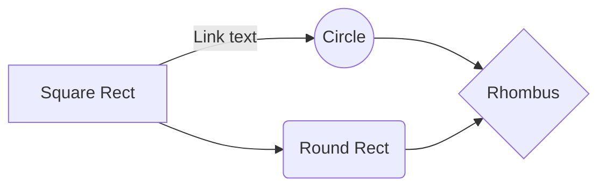

# Inhoudsopgave
```toc
```

## Missie en visie

****

## Systemen

In welke systemen zit je?

- Projectgroep
- Bedrijf
- School
- Studentenwoning

Met welke andere systemen heb je te maken?
- Commisie's
- OV

Waar ben je belanghebbende van een systeem?
- Werk
- School

****

## Doelstelling

Als "jij" het systeem bent...

*Wat zijn dan jouw doelen ? *

**Korte termijn**

- Overleven
- Eten
- Drinken
- Les volgen
- BSA

**Middel lange termijn**
- Goed werk vinden
- Diploma halen

**Lange termijn**
- Een eigen woning kopen
- Bedrijf starten

****

*Wat is jouw bottleneck?*
- Tijd
- Geld
- Rust

*Wie of wat weerhoudt je er van je doelen te halen?*
- School
- Werk
- Prijzen

****

*Wat zijn jouw constraints?*

![[Evaporating cloud.canvas|Evaporating cloud]]


