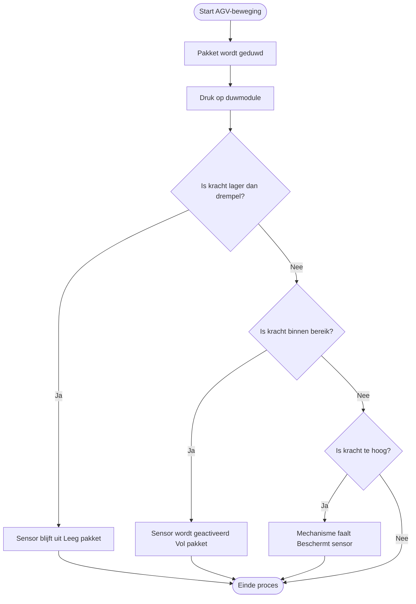

```mermaid
flowchart TD
    start([Start AGV-beweging])
    duw[Pakket wordt geduwd]
    detectie[Druk op duwmodule]
    krachtcheck1{Is kracht lager dan drempel?}
    sensorNietActief[Sensor blijft uit Leeg pakket]
    krachtcheck2{Is kracht binnen bereik?}
    sensorActief[Sensor wordt geactiveerd Vol pakket]
    krachtcheck3{Is kracht te hoog?}
    breuk[Mechanisme faalt Beschermt sensor]
    stop([Einde proces])

    start --> duw --> detectie
    detectie --> krachtcheck1

    krachtcheck1 -- Ja --> sensorNietActief --> stop
    krachtcheck1 -- Nee --> krachtcheck2

    krachtcheck2 -- Ja --> sensorActief --> stop
    krachtcheck2 -- Nee --> krachtcheck3

    krachtcheck3 -- Ja --> breuk --> stop
    krachtcheck3 -- Nee --> stop
```